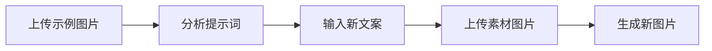

# 图片素材替换生成器 | Image Material Replacer Skill


## 📖 简介

**图片素材替换生成器** 是一个基于 AI 的智能图片生成技能，能够分析示例图片的视觉风格，结合用户自定义文案和新素材，快速生成风格统一的 16:9 高质量图片。

### 核心功能
- 🔍 **智能分析**：自动提取示例图片的提示词和风格特征
- ✏️ **文案定制**：支持用户自定义标题和描述
- 🖼️ **素材融合**：将新素材图片的元素融入原有风格
- 🎨 **高质量输出**：生成 16:9 比例的 4K 高清图片

---

## 🚀 快速开始

### 系统要求
- Karma AI 平台账号
- 支持图片上传的对话环境
- 已安装 "图片提示词反向分析器" skill

### 安装方法

#### 方法1：通过 Karma Skill Creator（推荐）
1. 下载本项目的 `skill-config.xml`
2. 打开 Karma AI Skill Creator
3. 导入配置文件
4. 激活技能

#### 方法2：手动配置
参考 `skill-config.xml` 中的配置，在 Skill Creator 中逐步创建。

---

## 💡 使用流程

### 完整4步工作流



### 详细步骤说明

#### 第1步：上传并分析示例图片
```
用户操作：上传一张参考图片
系统动作：
  1. 接收图片
  2. 调用"图片提示词反向分析器"
  3. 提取视觉元素、风格、构图等信息
  4. 展示分析结果
```

#### 第2步：修改标题和描述文案
```
用户操作：
  - 输入新标题（如："春季新品发布"）
  - 输入描述文案（如："清新自然的春季产品展示，柔和光线..."）
系统动作：
  - 记录用户输入
  - 确认文案已保存
```

#### 第3步：上传新素材图片
```
用户操作：上传要融入的素材图片
系统动作：
  1. 接收素材图片
  2. 分析主要元素、颜色、风格
  3. 提取关键特征
```

#### 第4步：生成新图片
```
系统动作：
  1. 组合：原图风格 + 新文案 + 素材元素
  2. 构建最终提示词
  3. 调用 Gemini 图像生成（16:9, 4K）
  4. 返回生成结果（30-90秒）
```

---

## 📋 应用场景

### 1. 电商产品图批量生成
**场景**：保持品牌视觉风格，快速生成不同产品的营销图
```
示例图：品牌A的产品展示图（风格：简约现代）
新素材：品牌A的新款产品照片
结果：风格统一的新产品营销图
```

### 2. 社交媒体配图
**场景**：为不同内容生成统一风格的配图
```
示例图：之前表现好的社媒配图
新文案：新的活动主题和文案
结果：风格一致的系列配图
```

### 3. 广告创意迭代
**场景**：基于优质广告创意，快速生成变体
```
示例图：高转化的广告素材
新素材：不同的产品或场景
结果：相似风格的多版本广告图
```

### 4. 品牌视觉统一化
**场景**：将旧素材升级为统一的新品牌风格
```
示例图：新品牌视觉规范示例
旧素材：历史产品照片
结果：符合新品牌风格的更新图片
```

---

## 🛠️ 技术架构

### 依赖的AI能力
- **图片提示词反向分析器**：提取图片的视觉特征
- **Gemini 图像生成**：生成高质量图片
- **图像分析引擎**：分析素材特征

### 数据流
```
输入层                处理层                  输出层
┌─────────┐         ┌──────────┐          ┌──────────┐
│示例图片  │────────>│提示词提取 │          │          │
└─────────┘         └──────────┘          │          │
                           │               │          │
┌─────────┐         ┌──────────┐          │ 最终图片  │
│用户文案  │────────>│文案整合   │─────────>│  16:9   │
└─────────┘         └──────────┘          │   4K    │
                           │               │          │
┌─────────┐         ┌──────────┐          │          │
│素材图片  │────────>│特征提取   │          │          │
└─────────┘         └──────────┘          └──────────┘
```

---

## 📝 配置说明

### 主要配置项

| 配置项 | 默认值 | 说明 |
|--------|--------|------|
| 生成比例 | 16:9 | 输出图片的宽高比 |
| 图片质量 | 4K | 高清晰度输出 |
| 生成模型 | Gemini | 使用的AI图像生成模型 |
| 超时时间 | 90秒 | 图片生成最长等待时间 |

### 自定义选项

修改 `skill-config.xml` 中的以下部分可以自定义行为：

```xml
<!-- 修改输出比例 -->
<aspectRatio>16:9</aspectRatio>  <!-- 可选：1:1, 9:16, 4:3 等 -->

<!-- 修改图片质量 -->
<imageSize>4K</imageSize>  <!-- 可选：1K, 2K, 4K -->

<!-- 修改生成模型 -->
<tool>mcp__tool-gateway__gemini_generate_image</tool>
<!-- 可替换为：local_generate_image（本地模型） -->
```

---

## 🎯 最佳实践

### 示例图片选择建议
✅ **推荐**：
- 构图清晰、主体突出
- 风格明确、易于识别
- 高分辨率图片

❌ **不推荐**：
- 模糊、低分辨率
- 风格混杂、元素过多
- 版权受限的图片

### 文案撰写技巧
- **标题**：简洁明确（5-15字）
- **描述**：详细描绘画面内容
- 包含关键元素、氛围、光线等细节
- 使用形容词增强视觉感

### 素材图片准备
- 高质量原图（建议 > 1MB）
- 主体清晰、背景干净
- 与目标场景相关

---

## 📊 性能指标

| 指标 | 数值 |
|------|------|
| 平均生成时间 | 30-90秒 |
| 支持图片格式 | JPG, PNG, WEBP |
| 最大输入图片 | 10MB |
| 输出分辨率 | 最高 4K (3840×2160) |

---

## 🔧 故障排除

### 常见问题

#### Q: 生成的图片风格差异很大？
**A**:
- 检查示例图片是否风格明确
- 优化描述文案，增加更多细节
- 尝试多次生成选择最佳结果

#### Q: 素材元素没有融入？
**A**:
- 确保素材图片主体清晰
- 在描述文案中明确提到素材元素
- 提高素材图片的分辨率

#### Q: 生成失败或超时？
**A**:
- 检查网络连接
- 降低图片质量设置（4K → 2K）
- 稍后重试

#### Q: 提示找不到"图片提示词反向分析器"？
**A**:
- 确认该前置skill已安装
- 或手动分析示例图片并提供提示词

---

## 📚 示例教程

### 完整示例：生成春季产品图

**第1步：上传示例**
```
示例图：冬季产品展示图
分析结果：
- 风格：简约现代
- 色调：冷色调，深蓝+白色
- 构图：中心产品+极简背景
- 光线：柔和顶光
```

**第2步：输入文案**
```
标题：春季新品上市
描述：温暖明亮的春季产品展示，采用简约现代的风格，
      柔和的自然光，浅粉色和淡绿色的春季色调，
      产品居中摆放，清新的植物元素点缀背景
```

**第3步：上传素材**
```
素材：春季新款产品照片（白底）
分析：简洁造型，轻盈质感，适合春季主题
```

**第4步：生成结果**
```
输出：保持简约现代风格，融入春季色彩和植物元素，
      产品清晰展示，16:9横向构图，适合电商Banner使用
```

---

## 🤝 贡献指南

欢迎提交 Issue 和 Pull Request！

### 开发建议
- Fork 本项目
- 创建特性分支 (`git checkout -b feature/AmazingFeature`)
- 提交改动 (`git commit -m 'Add some AmazingFeature'`)
- 推送到分支 (`git push origin feature/AmazingFeature`)
- 开启 Pull Request

---

## 📄 许可证

本项目采用 MIT 许可证 - 查看 [LICENSE](LICENSE) 文件了解详情

---

## 📞 联系方式

- **作者**: Karma AI Team
- **平台**: [EOS3 Community](https://eos3.ai)
- **技术支持**: karma@eos3.ai

---

## 🌟 致谢

感谢以下项目和技术：
- Gemini AI - 图像生成能力
- Karma AI Platform - 技能执行框架
- EOS3 Community - 开源社区支持

---

## 📈 更新日志

### v1.0.0 (2026-01-29)
- ✨ 初始版本发布
- 🎨 支持 16:9 图片生成
- 🔍 集成提示词反向分析
- 📝 支持自定义文案
- 🖼️ 支持素材融合

---

**⭐ 如果这个项目对你有帮助，欢迎 Star 支持！**
